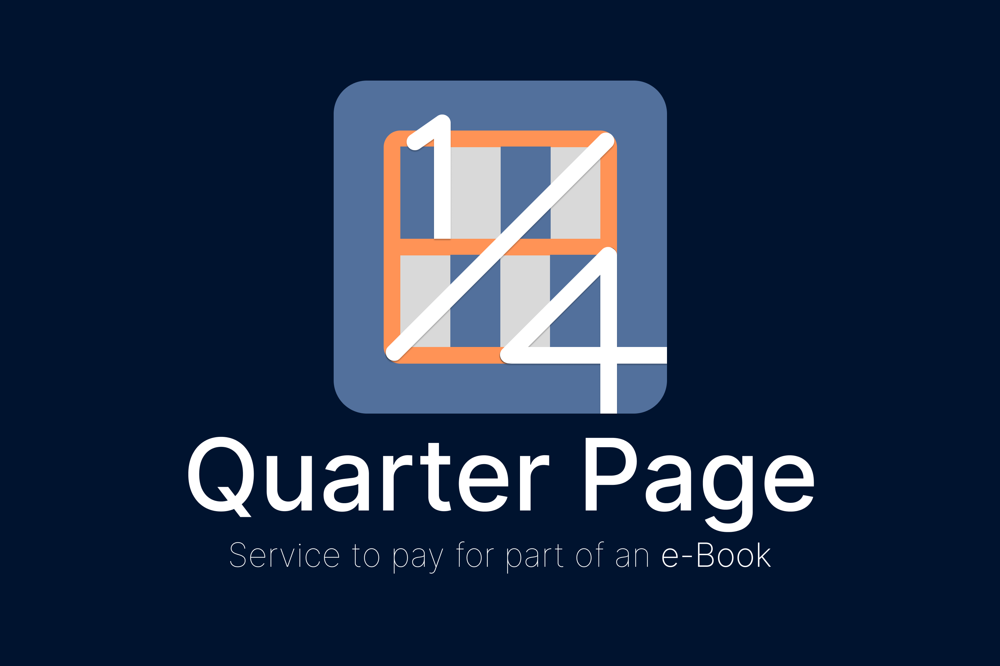

# 📘 Quarter-Page

### 📖 Introduction

1/4 Page는 부분 결제를 도입한 전자책 애플리케이션입니다.
책의 필요한 부분만 읽고 싶거나, 결제가 부담되는 분들을 위해서 고안되었습니다.
읽고싶은 챕터만 결제하거나 전체를 구매할 수 있습니다.

### 📚 Stack

- Android Kotlin
- Android Studio
- Glide
- Firebase

## ⌨️ OnBoarding, Login

## 📱 Main Screen

> #### 📝 Commit Convention
>
> - Doc: README 파일 등의 문서 파일 갱신 시 사용
> - Add: 파일이 추가되었을 때 사용
> - Update: 간단한 기능 추가 또는 파일 변경에 사용
> - Fix: 버그를 고쳤을 때 사용
> - Delete: 사용되지 않는 파일 제거에 사용
